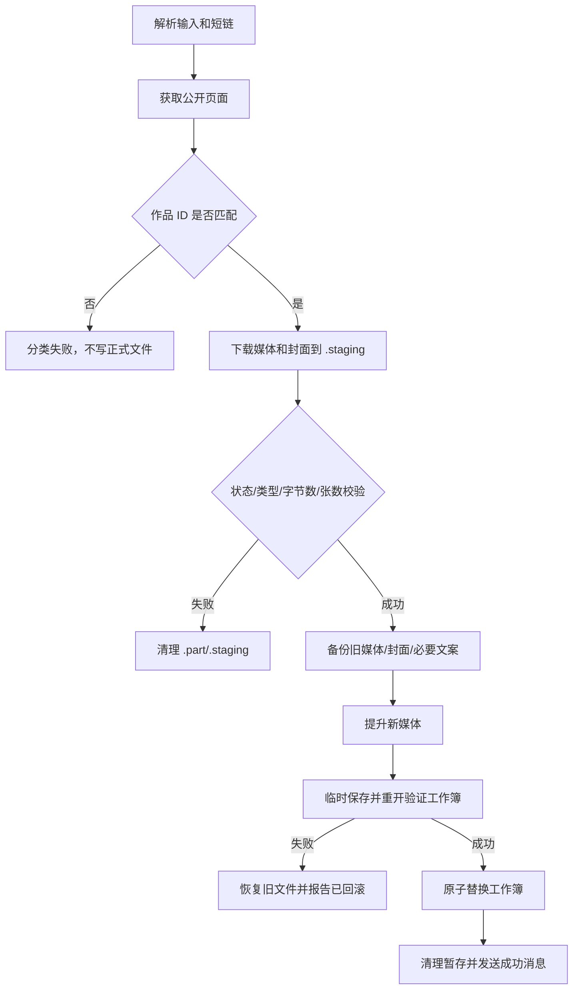

# 架构说明

## 目标

工具的首要设计目标不是最高吞吐量，而是在网络失败、页面结构变化、用户取消、Office 文件占用和进程退出时，尽量不损坏已经存在的媒体、人工文案和记录表。

## 模块边界

| 模块 | 输入 | 输出 | 不负责 |
|---|---|---|---|
| `input_parser.py` | 输入框文本、旧工作簿记录 | 有序任务和锁定编号文本 | 联网、下载、写工作簿 |
| `extractor.py` | 分享链接、取消事件 | `FetchedRecord` 和暂存媒体 | 正式文件替换、Excel 更新 |
| `storage.py` | 暂存媒体、封面、工作簿回调 | 已提交产物或已回滚失败 | 页面解析、界面状态 |
| `exporter.py` | 记录字典、目标行和封面 | 原子保存的工作簿 | 网络请求、媒体下载 |
| `tasking.py` | 取消事件、消息数据 | 可中断等待和结构化消息 | Tkinter 控件操作 |
| `app.py` | 用户操作和任务消息 | 界面状态、任务调度、摘要 | 底层响应解析细节 |

## 单条作品处理流程

`FetchedRecord` 保存真正成功请求所使用的 Session，确保媒体请求沿用正确的请求上下文。页面递归解析只能接受 `aweme_id` 与目标作品一致的候选项，避免误取推荐作品。

## 文件事务

`ArtifactTransaction` 的暂存目录位于输出目录内，因此 `os.replace` 保持在同一文件系统上。提交顺序为：

1. 两种可能的旧媒体都进入时间戳备份，防止视频/图文切换残留冲突文件。
2. 同编号旧封面进入备份。
3. 图文替换时备份文案；视频替换保留已有人工文案。
4. 提升新媒体和封面。
5. 调用工作簿持久化回调。
6. 回调失败时删除已提升的新文件，并逆序恢复备份。

备份目录只有实际包含旧文件时才保留。

## 工作簿策略

`exporter.py` 按表头名称而非固定列号读取和迁移工作簿。它只更新工具管理的列，不重建整个工作簿，因此其它工作表、额外列和用户格式可以保留。

保存流程为：

1. 将工作簿写入同目录、唯一名称的临时文件。
2. 使用 `openpyxl` 以只读方式重新打开临时文件验证结构。
3. 把现有正式工作簿复制到 `表格备份`，只保留最近 5 份。
4. 使用 `os.replace` 提交临时文件。

权限错误统一转换为 `WorkbookInUseError`，由界面提示关闭目标工作簿后重试。

## 去重与迁移

- 新记录以 `aweme_id` 为唯一作品标识。
- 短链、长链和分享文案只用于定位作品，不作为最终去重主键。
- 旧记录没有作品 ID 时，可以在成功刷新后补齐。
- 文件大小相同不代表作品相同，只能提示用户人工确认。
- 旧版工作簿按表头名称读取，未知结构不会做破坏性猜测。

## 任务与取消

后台任务通过 `threading.Event` 接收取消请求。重试等待、批次间隔和媒体下载块都会检查事件。工作线程只发送 `TaskMessage`，Tkinter 主线程负责修改控件，避免跨线程直接操作界面。

关闭窗口时：

1. 如有任务运行，询问是否停止并退出。
2. 设置取消事件，界面进入“正在停止”。
3. 等待工作线程的 `finally` 完成清理和状态恢复。
4. 工作线程结束后再销毁窗口。

## 运行状态与发布边界

源码模式下的配置和输入缓存属于个人运行状态，不应进入 Git。发布版在 `data/` 中初始化空配置与空编号占位。构建脚本对 URL、Windows 用户目录和非空输入缓存做阻断式扫描。

如果便携目录不可写，运行时状态转移到 `%LOCALAPPDATA%`，而媒体输出目录仍由用户明确选择。
